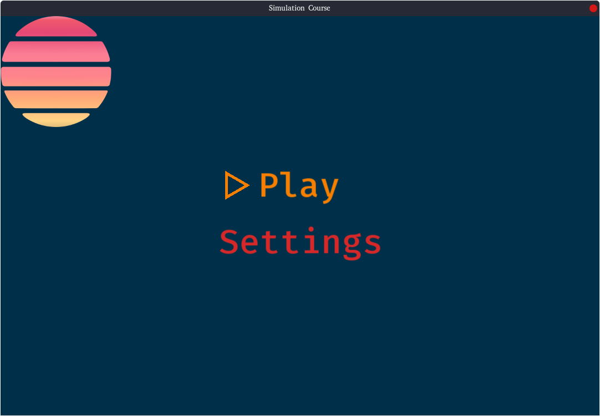
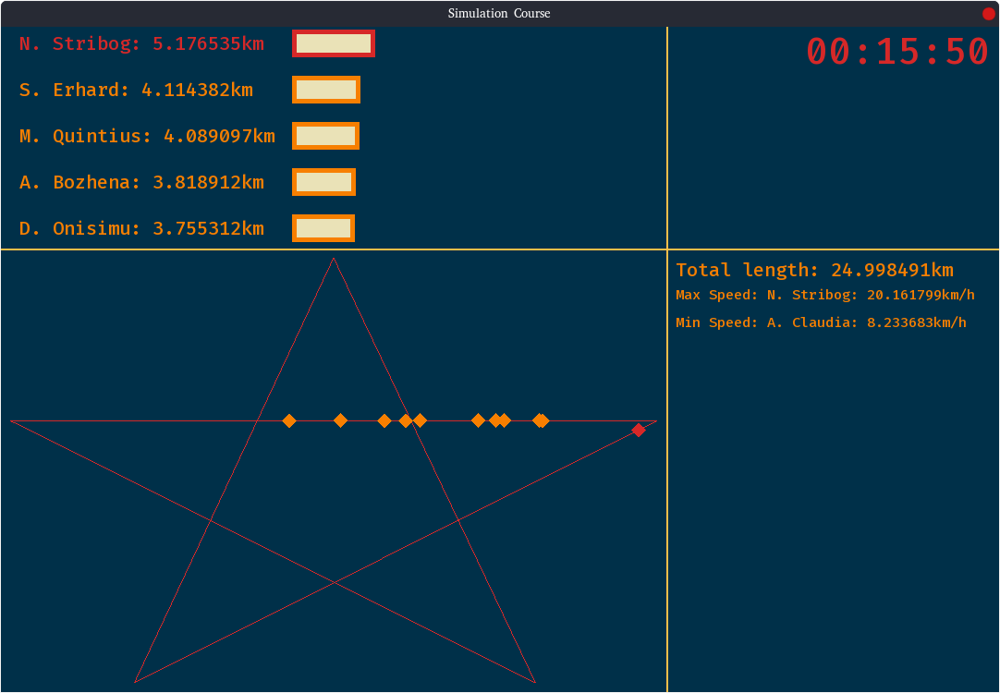

# CIR2-CourseAPied
A small project that took 1 month to complete.<br/>
This project is supposed to simulate a race between runners and display it in real time
<br/><hr/><br/>
# Installation
On Linux (tested on fedora 30-33)<br/>
*Make sure that you installed gcc, cmake and SFML*<br/>
```
git clone https://github.com/HugoMartel/CIR2-CourseAPied/ && cd ./CIR2-CourseAPied/
mkdir build && cd build
cmake ..
cd ..
cmake --build build
./SimulationCourse
```
<br/>
On Windows it should work with MSVC but it hasn't been tested yet (no time :sweat_smile:)<br/>
Run CMake and compile it using CMakeLists.txt
<br/><hr/><br/>
# Documentation
For more infos see the [doc]("https://github.com/HugoMartel/CIR2-CourseAPied/tree/main/doc")
*Contains the formulas used in the project explained and few infos*.

# Screenshots


